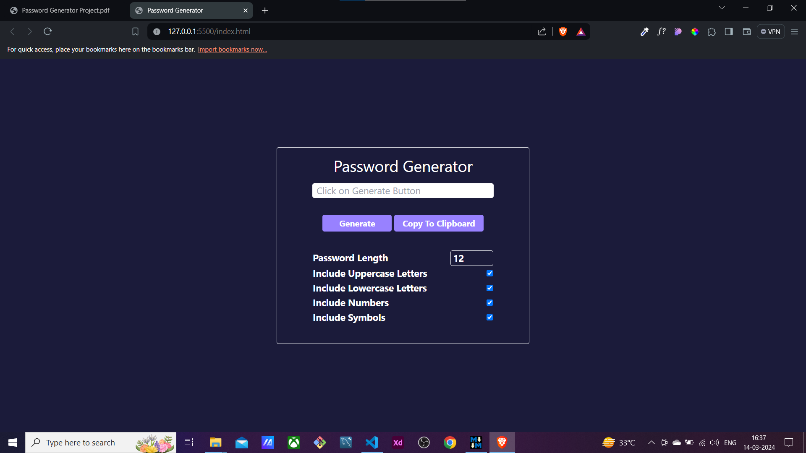
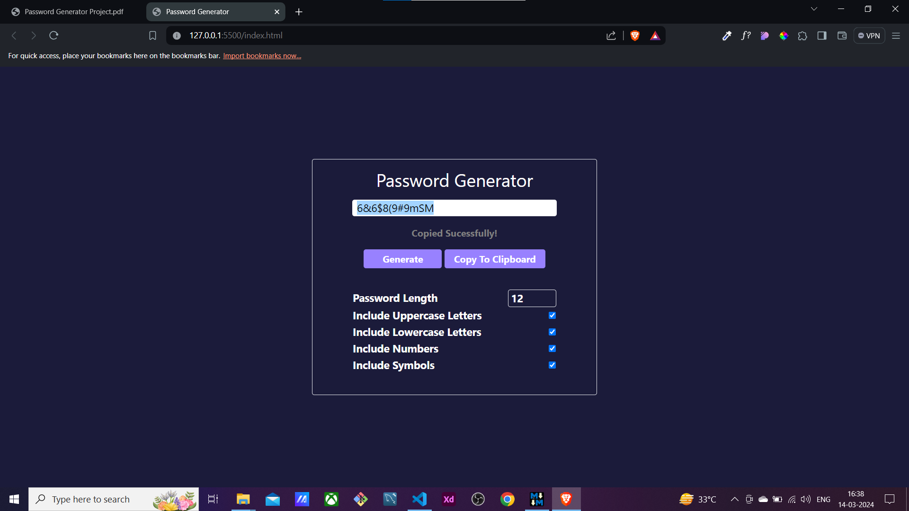

# Password Generator ✅

In this Project User has to Create a Password Generator, which allows the Users to Generate Random Passwords.

Technologies Used In Project are `HTML`, `Tailwind CSS` and `JavaScript`

## Features 🔑

- User can Generate Random Password.
- User can Copy the Password to Clipboard.
- User can Select the Password Length, Character which needs to be included in the Password.
- Password Length Validation.

## Tech Used 🔑

- HTML
- Tailwind CSS
- JavaScript

## Sample Output 👨‍💻

## Project Live Link 🎬

Password Generator - [Live Demo Link](https://password-generator-pw.netlify.app/)

## :hatched_chick: Find Repository Order As Follows in Project Repository Folders:

♥ Follow Me For More Projects [GitHub](https://github.com/ChinmayKaitade) | [LinkedIn](https://www.linkedin.com/in/chinmay-sharad-kaitade) | [Instagram](https://www.instagram.com/chinmaykaitade_hunter/)
